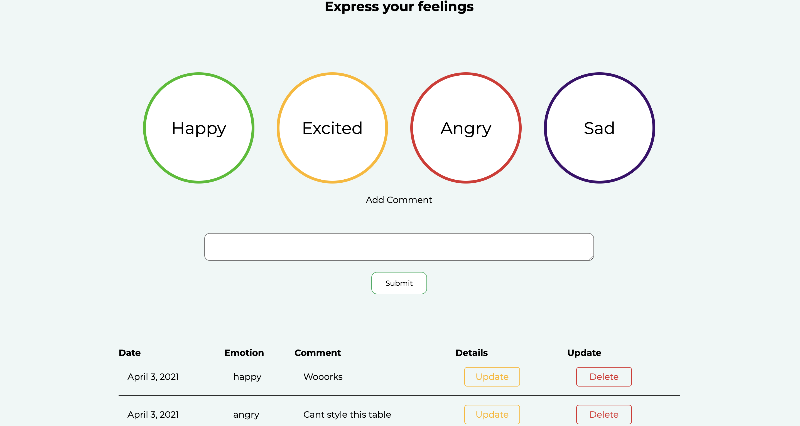
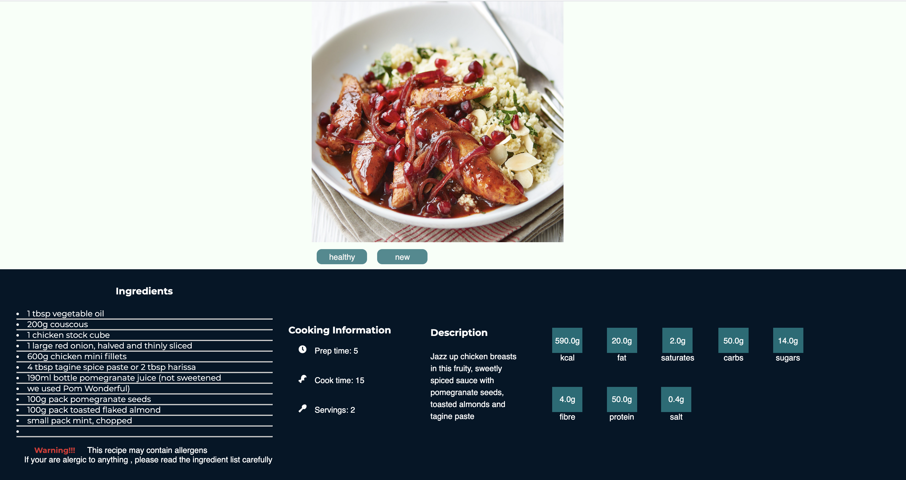
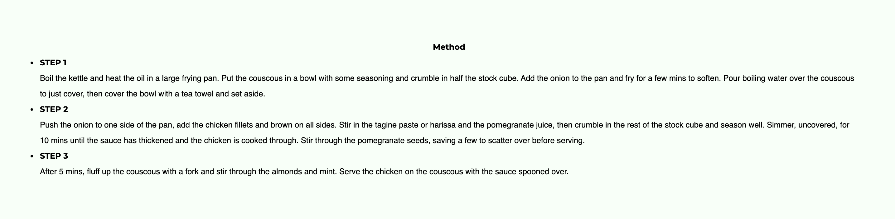

# Group A6 Coursework

# Table of Contents

- [Group A6 Coursework](#group-a6-coursework)
- [Table of Contents](#table-of-contents)
  - [Getting started](#getting-started)
    - [Install virtualenv (Windows) - optional](#install-virtualenv-windows---optional)
    - [Create a new virtual environment inside the project (Windows) - optional](#create-a-new-virtual-environment-inside-the-project-windows---optional)
    - [Activate your environment (Windows) - optional](#activate-your-environment-windows---optional)
    - [Install all the dependencies from requirements.txt](#install-all-the-dependencies-from-requirementstxt)
    - [Navigate to localhost:8000](#navigate-to-localhost8000)
  - [Project showcase](#project-showcase)
    - [That is our emotion tracker which works as a diary where the user can capture the exact emotion expreses at a certain time.](#that-is-our-emotion-tracker-which-works-as-a-diary-where-the-user-can-capture-the-exact-emotion-expreses-at-a-certain-time)
    - [The next is music meditation app which provides a calm beach or rain sound and nice images as well as a timer](#the-next-is-music-meditation-app-which-provides-a-calm-beach-or-rain-sound-and-nice-images-as-well-as-a-timer)
    - [And the last one is the nutrtion planner app more precisely  one of the recipes that the app includes](#and-the-last-one-is-the-nutrtion-planner-app-more-precisely--one-of-the-recipes-that-the-app-includes)
  

## Getting started

To get started with project you would need to have [python](https://www.pythonorg/downloads/) 

Once cloned the project open the terminal and navigate to the project directory.

### Install virtualenv (Windows) - optional
    py -m pip install --user virtualenv

### Create a new virtual environment inside the project (Windows) - optional

    py -m venv env

### Activate your environment (Windows) - optional

    .\env\Scripts\activate

### Install all the dependencies from requirements.txt

    pip install -r requirements.txt

run the project by typing:

    python manage.py runserver

 ### Navigate to localhost:8000

 After you type the command above in the terminal you should now see the following lines:

    Watching for file changes with StatReloader
    Performing system checks...
    System check identified no issues (0 silenced).
    April 08, 2021 - 13:59:10
    Django version 3.1.6, using settings 'health_app.settings'
    Starting development server at http://127.0.0.1:8000/
    Quit the server with CONTROL-C.

You have to copy the following [link](http://127.0.0.1:8000/)

## Project showcase
&nbsp;

In these next lines I am going to show you parts of our project if you want to see more follow these [steps](#getting-started)

### That is our emotion tracker which works as a diary where the user can capture the exact emotion expreses at a certain time.

&nbsp;

### The next is music meditation app which provides a calm beach or rain sound and nice images as well as a timer 

&nbsp;

### And the last one is the nutrtion planner app more precisely  one of the recipes that the app includes

&nbsp;

